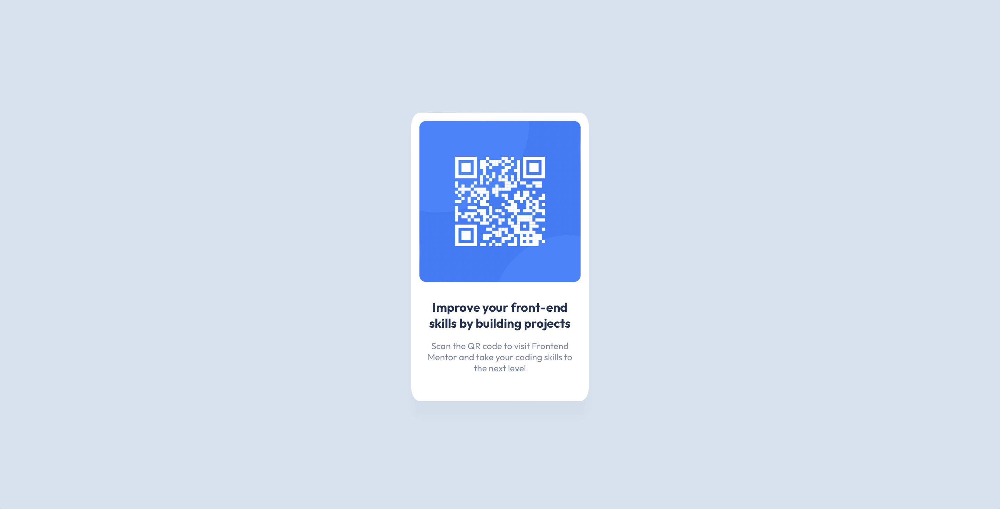

# Frontend Mentor - QR code component solution

Here's my take on the Frontend Mentor QR code component challenge! Check out the full challenge here, along with the rest of their site: https://www.frontendmentor.io/challenges/qr-code-component-iux_sIO_H

## Table of contents

- [Overview](#overview)
  - [Screenshot](#screenshot)
  - [Links](#links)
- [My process](#my-process)
  - [Built with](#built-with)
  - [What I learned](#what-i-learned)
  - [Useful resources](#useful-resources)
- [Author](#author)

## Overview

### Screenshot

### Links

- Solution URL: [https://github.com/varsvisualizes/qr-code/tree/main]
- Live Site URL: [https://your-live-site-url.com]

## My process

### Built with

- Semantic HTML5 markup
- CSS custom properties
- Flexbox
- CSS Grid

### What I learned

This project felt like an exercise in layouts: getting everything centered and spaced out correctly was the goal, without much decoration or excess. A neat and simple challenge to start going through Frontend Mentor. 

One of the tricker bits of it for me was getting the sizing just right - even still, I feel like the card is juuuuuust a hair off from the correct dimensions. But, I did get the line breaks in the text correct, and while that's a small detail in the grand scheme, it makes me happy that it came out right.

That drop shadow kept playing tricks on my eyes! At first I didn't notice it, but as I built I realized that the card just wasn't popping out against the background. With enough squinting and adjusting the screen brightness, I could see that little shadow hanging out, making all the difference. 

### Useful resources

- [Kevin Powell's Responsive Product Preview Card Component video](https://www.youtube.com/watch?v=B2WL6KkqhLQ) - Before taking on this challenge, I followed along with a couple of Kevin Powell's tutorials. This is the one that really helped me get a sense of how to view a design, break it down, and build it back myself. 

## Author

- Website - [Carmen Peterson](https://campsite.bio/varsvisualizes)
- Frontend Mentor - [@varsvisualizes](https://www.frontendmentor.io/profile/varsvisualizes)
- Twitter - [@varsvisualizes](https://twitter.com/varsvisualizes)
